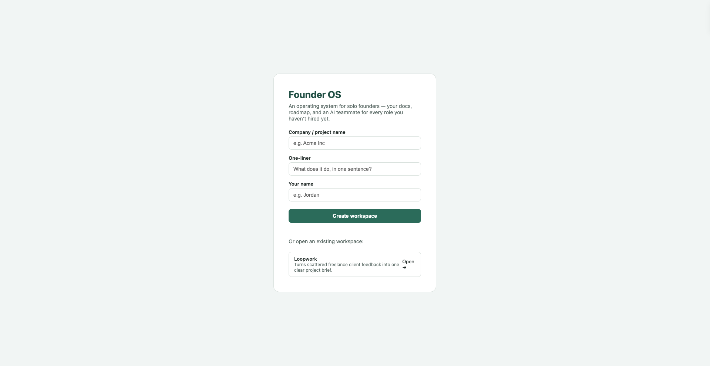
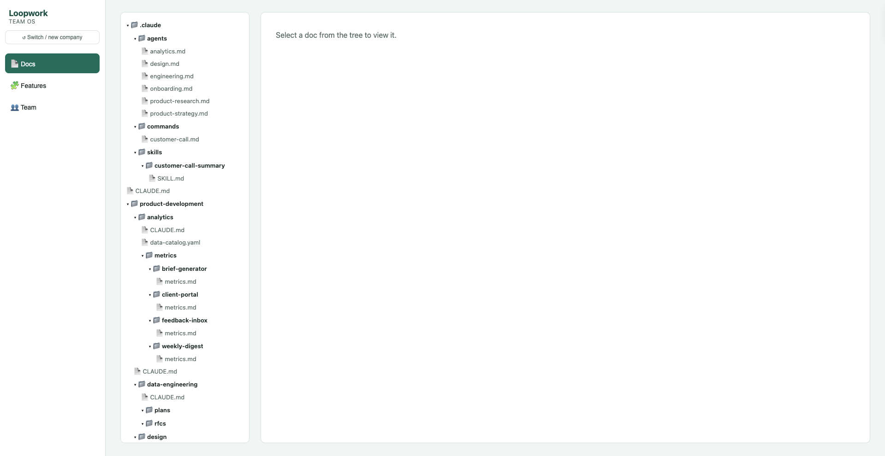
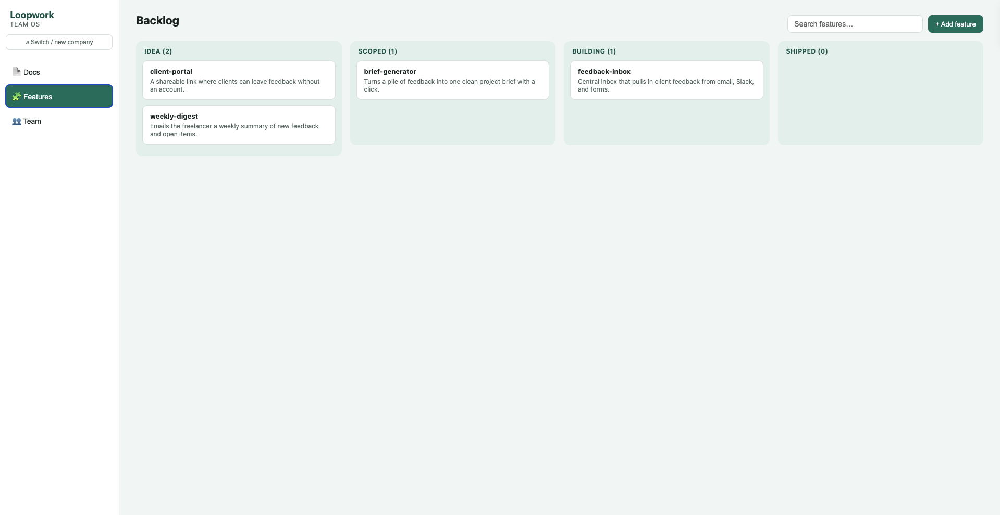
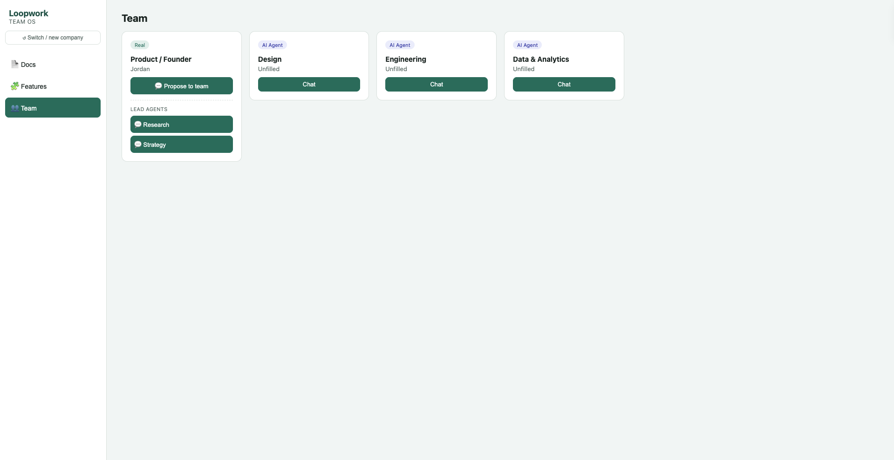
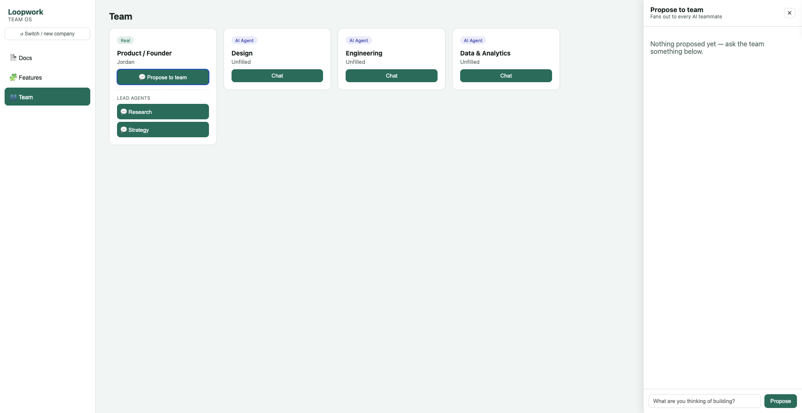

# Getting Started with Founder's AI Team

A step-by-step walkthrough for setting up and using Founder's AI Team for the first time. No prior context needed.

## What this is

Founder's AI Team generates a "Team OS," a structured docs repo (product context, strategy, engineering, analytics) for your company, and gives you a local web app to browse it, manage a backlog, and chat with AI teammates standing in for roles you haven't hired yet.

## 1. Prerequisites

- [Node.js](https://nodejs.org) installed (v18+). Check with `node --version` in a terminal.
- An API key from one provider:
  - **Anthropic** (recommended): [console.anthropic.com](https://console.anthropic.com) → Settings → API Keys
  - **Gemini**: [aistudio.google.com](https://aistudio.google.com) → get API key (starts with `AIzaSy...`)

## 2. Install and run

```bash
git clone <this-repo-url>
cd founders-ai-team/webapp
npm install
cp .env.example .env
```

Open `.env` in any text editor and paste your key into either line:

```
ANTHROPIC_API_KEY=your-key-here
# or
GEMINI_API_KEY=your-key-here
```

Then start it:

```bash
npm start
```

You should see:

```
Founder's AI Team running at http://localhost:4174
```

Open **http://localhost:4174** in your browser.


*The first screen you'll see: create a new company or open an existing one.*

## 3. Create your company

Fill in:
- **Company / project name**: e.g. "Acme Inc"
- **One-liner**: one sentence describing what it does
- **Your name**: you, as the founder

Click **Create workspace**. This instantly generates a full docs structure for your company under `workspaces/<your-company-slug>/`: nothing to configure, it's ready immediately.

## 4. Tour: Docs tab

The left tree shows every file in your company's workspace: click any file to render it. This is a live view of the actual files on disk; edit them with any text editor and refresh to see changes.



Key files to know about:
| File | What it's for |
|------|----------------|
| `CLAUDE.md` (root) | Team roster + doc index |
| `product-development/product/CLAUDE.md` | Product context, pillars, users |
| `product-development/product/strategy/` | Vision, roadmap, business context |
| `product-development/product/customers/` | Call notes, account context |
| `product-development/feature-index.yaml` | Every feature mapped to its docs |

## 5. Tour: Features tab (the backlog)

A Kanban board (Idea / Scoped / Building / Shipped) generated from `feature-index.yaml`.



- **+ Add feature**: creates a new card plus stub PRD/plan/metrics files
- **Drag a card** between columns to update its status (saved to disk immediately)
- **Search** filters by name or description

## 6. Tour: Team tab (your AI teammates)

Every function starts as an AI agent, grounded in that function's docs:



- **Product / Founder**: that's you, marked "Real"
- **Design / Engineering / Data & Analytics**: AI agents, click **Chat** to talk to any of them
- **Lead Agents** (under Product): **Research** and **Strategy**, two extra sub-agents for those specific sub-skills

Click **Chat** on any agent to open a conversation panel. Ask it something about your product: it answers grounded in your actual docs, and tells you honestly when a doc is still empty rather than making things up.

### Propose to team

Click **Propose to team** on the Product card to fan one question out to every agent at once:



Each agent gives its take from its own function's perspective. If you like where a discussion lands, click **Turn into feature** on that response: it drafts a name and one-liner from the discussion and adds it straight to your backlog.

## 7. Bringing on a real person

Once you hire someone (or bring on a co-founder), open the root `CLAUDE.md` and replace their row:

```diff
- | Design | TBD | AI Agent |
+ | Design | Sam Rivera | Real |
```

The AI agent stays available in the background either way: nothing to delete.

## 8. Using `/customer-call`

If you're using this alongside Claude Code directly (not just the web app), run `/customer-call` after any customer/prospect call: it walks through saving a summary + transcript to `product-development/product/customers/accounts/<name>/`, following the style guide in `.claude/skills/customer-call-summary/SKILL.md`.

## Troubleshooting

**"Port 4174 is in use" / `EADDRINUSE`**
Something else (often a previous, still-running copy of this same server) is using the port. Stop it first:
```bash
lsof -ti:4174 | xargs kill -9
```
Then `npm start` again.

**Stopping the server doesn't work with Cmd+C**
On Mac, use **Control+C** (the key in the corner), not **Cmd+C** (next to the space bar): Cmd+C is "copy," it does nothing in a running terminal process.

**Chat says "No API key set"**
Your `.env` is empty or the server hasn't been restarted since you added the key. Env vars only load when the process *starts*: stop it (Control+C) and run `npm start` again.

**Changed `.env` but nothing's different**
Same cause as above: restart the server after any `.env` change.

## Contributing screenshots

The image references above point to `docs/screenshots/`. If you're setting this up fresh, feel free to add your own screenshots at those paths (`01-setup.png` through `08-propose-panel.png`) and open a PR: they'll render automatically in this file.
